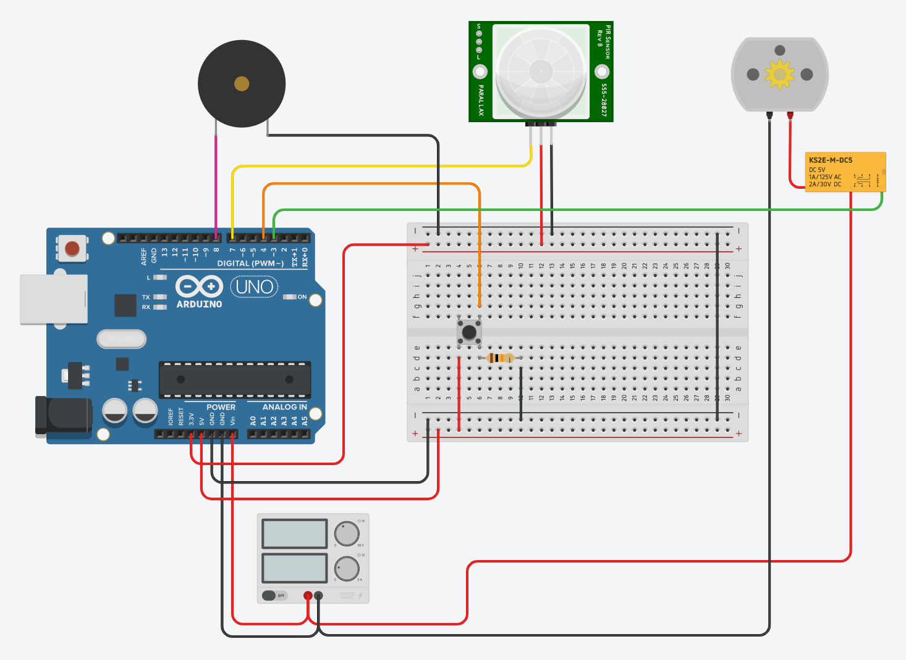
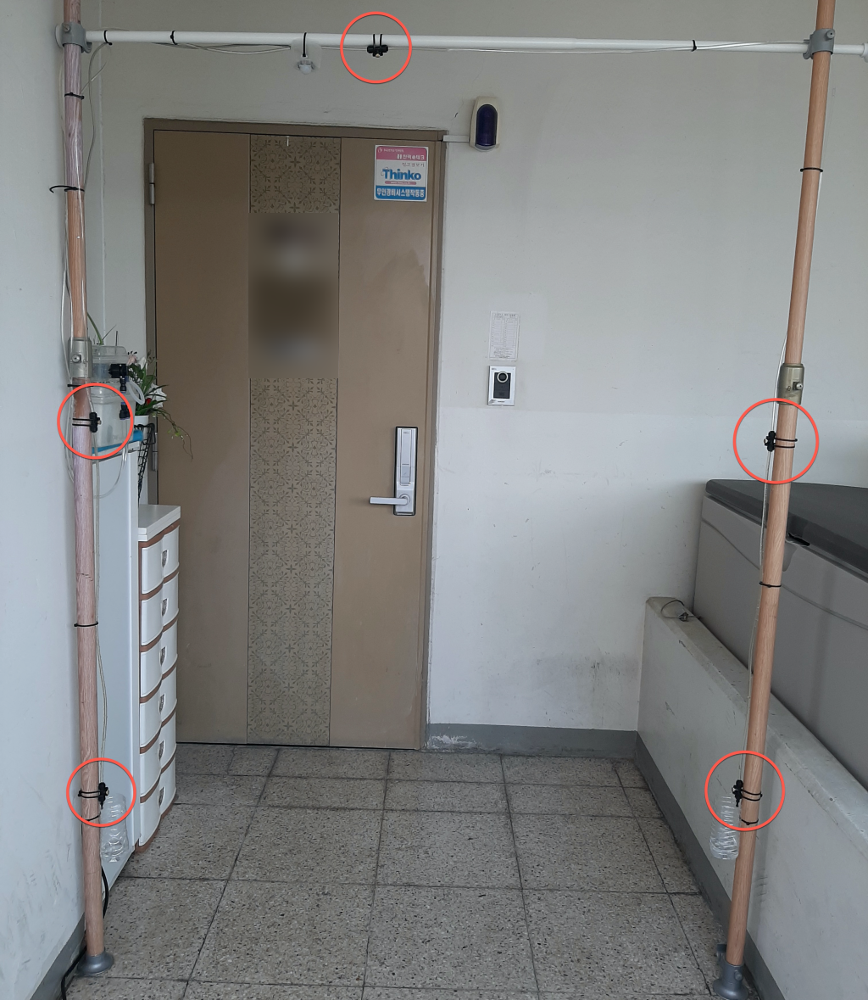
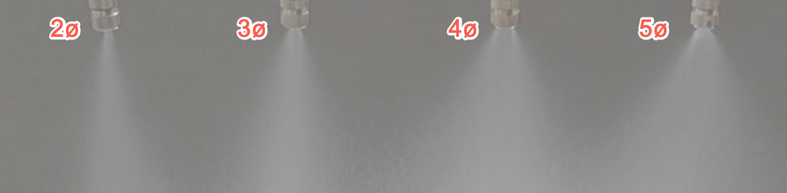

# auto-spray

arduino, raspberry-pi, lattepanda와 같은 오픈소스 하드웨어를 활용한 소독제 자동 분사 장치

[작동 확인 in YouTube](https://youtu.be/r1yaet-WIyA)

## 기여자
  * 바이커 (greath99@gmail.com)
  * 라파엘 (avatar196kc@naver.com)

## 설치 방법

###  목차
1. [부품 준비](#1-부품-준비)
2. [오픈소스 하드웨어 준비](#2-오픈소스-하드웨어-준비)
3. [분사 장치 설치](#3-분사-장치-설치)
4. [장치 설치 팁](#4-장치-설치-팁)

### 1. 부품 준비

1. __액상 소독제 분사 노즐 위치 결정__
    설치 예시에는 상단1개, 좌우 각각 2개씩 설치하였다.
    

2. __노즐 크기__
    노즐은 분사량을 고려하여 4ø 또는 5ø로 준비한다. (5ø 권장)
    각 구경에 따른 분사량은 아래 그림을 참조한다.
    

3. __우레탄 튜브 굵기 및 길이__
    노즐 위치와 하드웨어 배치 위치를 고려하여 우레탄 튜브길이를 계산한다.
    설치 예시에서는 노즐 사이에 외경 6ø를 사용하였다.

4. __하드웨어 부품 준비__
    푸시 버튼 1개
    10K 저항 1개
    12v 워터 펌프 1개
    5v 릴레이 1개
    피에조 스피커 1개
    인체감지 센서 1개

### 2. 오픈소스 하드웨어 준비

#### 아두이노

1. __회로도__
    

2. __스케치 업로드__

### 3. 분사 장치 설치

1. __튜브 및 노즐 배선__
2. __오픈소스 하드웨어 거치 및 배선__
3. __분사 테스트__
4. __인체감지 센서 감도 및 지연시간 조절__

### 4. 장치 설치 팁
  * 소독액 통은 입수구에 가까이 있는 것이 분사 시간 줄이는 데 도움 됩니다.
  * 최대한 튜브 길이를 짧게 쓰는 것이 실제 분사 효과를 높이는데 도움 됩니다.
  * 사용 후 잔여 소독액이 압력탓에 노즐을 통해 흘러 실내에서 사용에 적합하지 않습니다.
  * 좌우 노즐 아래에 잔여 소독액 받침을 두는 것이 좋습니다.

### 5. 소독액
  * 쇼핑몰에서 '코로나 소독제'로 검색하면 나오는 제품이 있으며 이를 사용해도 됩니다.
  * 손 쉽게 만들 수 있는 소독제 파악중...
